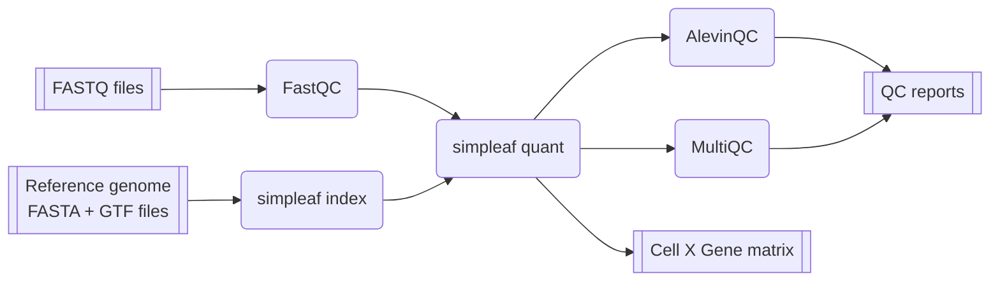

# nf-core/miniranger

[](https://www.nextflow.io/)
[](https://docs.conda.io/en/latest/)
[](https://www.docker.com/)
[](https://sylabs.io/docs/)
[](https://www.nf-test.com)

## Introduction

**nf-core/miniranger** is a lightweight bioinformatics pipeline that can be used to analyse single cell RNA sequencing (scRNA-seq) utilizing mainly [simpleaf(https://simpleaf.readthedocs.io/en/latest/index.html)]. simpleaf is a rust framework that simplifies the processing of single cell data using tools from the [alevin-fry(https://alevin-fry.readthedocs.io/en/latest/)] ecosystem. The pipeline takes a samplesheet, FASTQ files, and reference genome FASTA and annotation (gtf) files as input. It performs quality control (QC) and pseudoalignment, and produces a cell x gene expression matrix and QC report as output.



1. Read QC ([`FastQC`](https://www.bioinformatics.babraham.ac.uk/projects/fastqc/))
2. Index reference genome ([`simpleaf index`](https://simpleaf.readthedocs.io/en/latest/index-command.html))
3. Pseudo-alignment ([`simpleaf quant`](https://simpleaf.readthedocs.io/en/latest/quant-command.html))
4. QC report for raw reads ([`MultiQC`](http://multiqc.info/))
5. QC report for simpleaf ([`alevinQC`](https://csoneson.github.io/alevinQC/articles/alevinqc.html))


## Usage

> [!NOTE]
> If you are new to Nextflow and nf-core, please refer to [this page](https://nf-co.re/docs/usage/installation) on how to set-up Nextflow. Make sure to [test your setup](https://nf-co.re/docs/usage/introduction#how-to-run-a-pipeline) with `-profile test` before running the workflow on actual data.

First, prepare a samplesheet with your input data that looks as follows:

`samplesheet.csv`:

```csv
sample,fastq_1,fastq_2
PBMC_1k,PBMC_1k_S1_L001_R1_001.fastq.gz,PBMC_1k_S1_S1_L002_R2_001.fastq.gz
```

Each row represents a fastq file (single-end) or a pair of fastq files (paired end). Rows with the same sample identifier are considered technical replicates and merged automatically.

Now, you can run the pipeline using:

```bash
nextflow run nf-core/miniranger \
   -profile <docker/singularity/conda/test> \
   --input samplesheet.csv \
   --outdir <OUTDIR> \
   --fasta genome.fa \
   --gtf genes.gtf
   --chemistry 10xv3
```

> [!WARNING]
> Please provide pipeline parameters via the CLI or Nextflow `-params-file` option. Custom config files including those provided by the `-c` Nextflow option can be used to provide any configuration _**except for parameters**_; see [docs](https://nf-co.re/docs/usage/getting_started/configuration#custom-configuration-files).


## Citations

nf-core/miniranger was originally written by Sam Chen

This pipeline uses code and infrastructure developed and maintained by the [nf-core](https://nf-co.re) community, reused here under the [MIT license](https://github.com/nf-core/tools/blob/main/LICENSE).

> **The nf-core framework for community-curated bioinformatics pipelines.**
>
> Philip Ewels, Alexander Peltzer, Sven Fillinger, Harshil Patel, Johannes Alneberg, Andreas Wilm, Maxime Ulysse Garcia, Paolo Di Tommaso & Sven Nahnsen.
>
> _Nat Biotechnol._ 2020 Feb 13. doi: [10.1038/s41587-020-0439-x](https://dx.doi.org/10.1038/s41587-020-0439-x).
